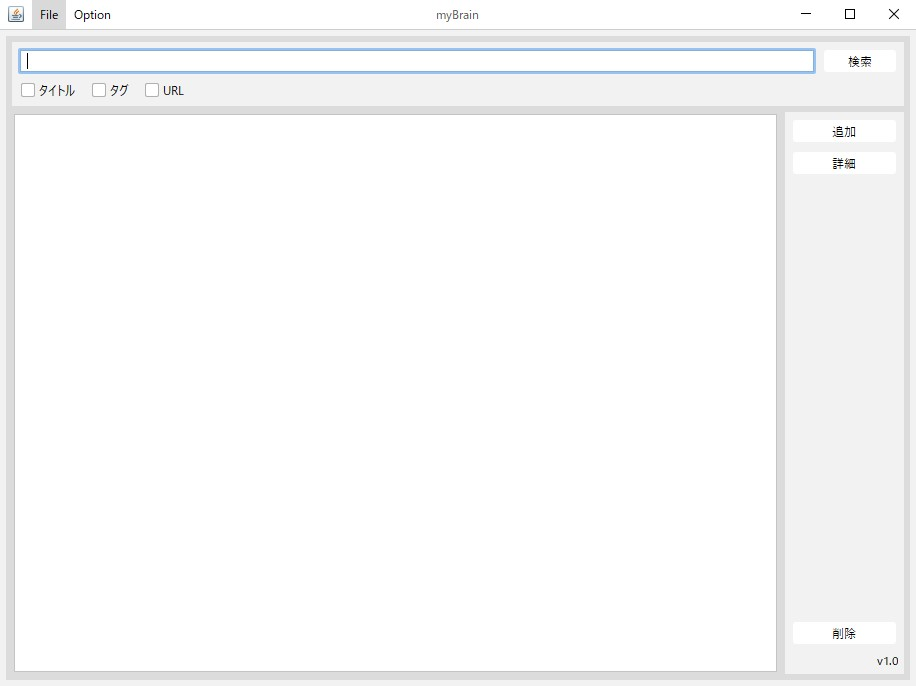
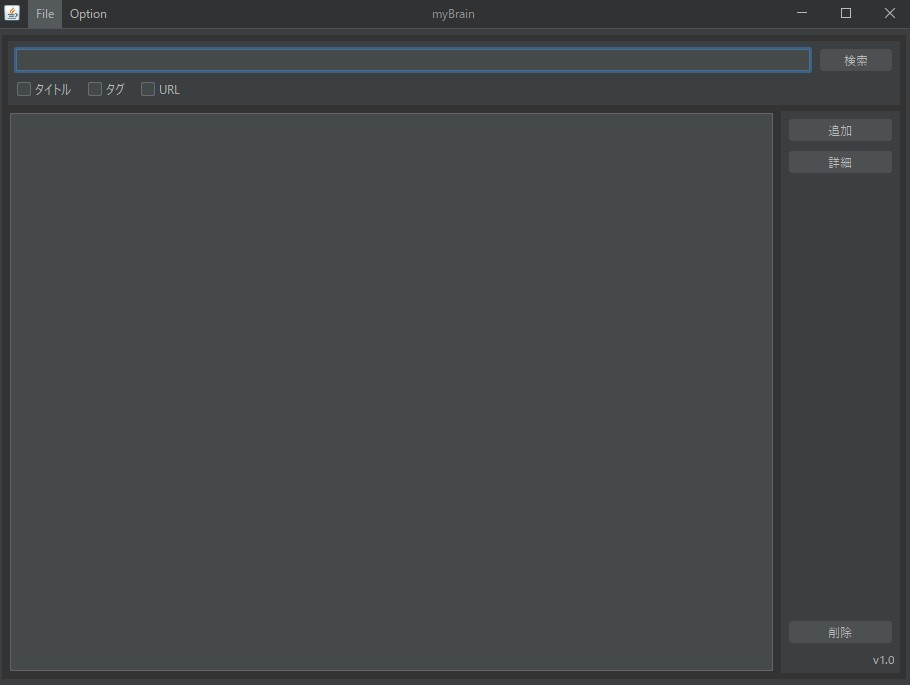
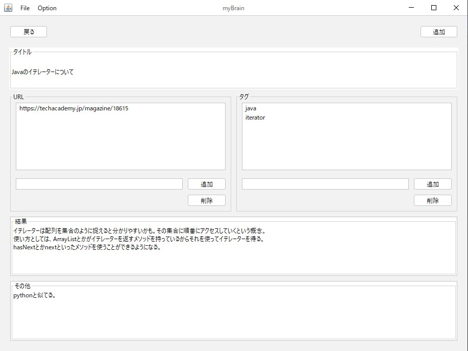
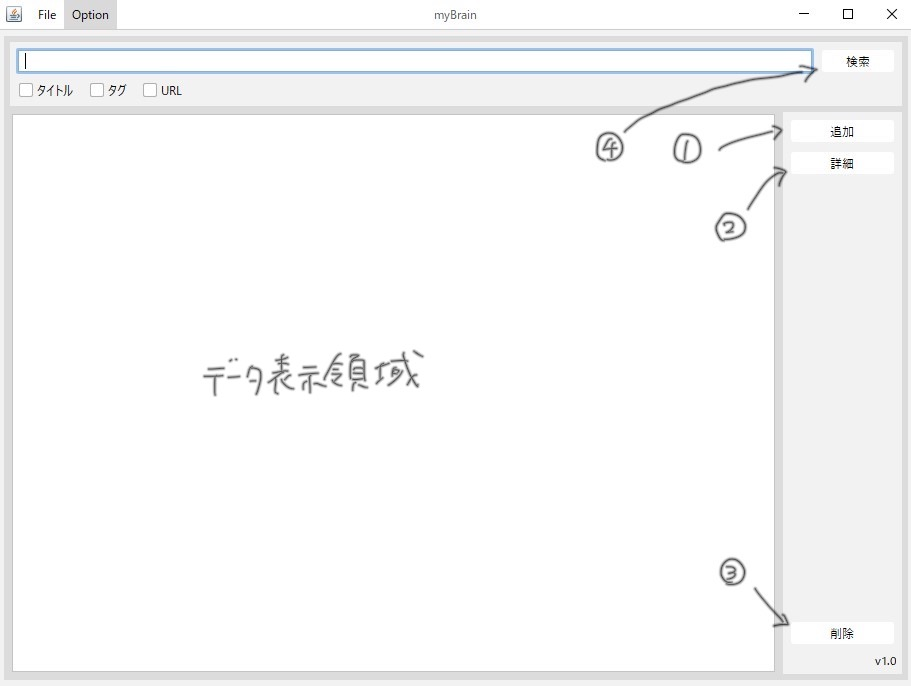

# myBrain

このプログラムは、自分の得た知識を保存することができる、知識保存システムです。

# DEMO
ライトモード

ダークモード

# Features

このプログラムは、プログラミングなどの勉強中に学んだことを保存しておけるシステムである。

このシステムを作ろうと思ったきっかけとしては、プログラムの作成中、使い方の分からないクラスや概念などを調べたとき、その調べたことをまた調べずにすむように、保存して後で見返せるようなシステムがほしいとおもったからである。

# Requirement
## Library
* Gson 2.8.0
* FlatLaf 1.6.1
  * FlatLaf-extras 2.0

# Usage

`myBrain-1.0.jar`がこのプログラムの実行ファイル。

`myBrainData.json`は、知識が詰め込まれている。本プログラムはそこからデータを読み込み、表示、編集、追加を行う。

## データ一覧画面

1. 追加ボタンを押すと、データ追加画面へ遷移する。

2. 詳細ボタンを押すと、選択したデータの詳細情報を見ることができる

3. 削除ボタンは、選択したデータの削除ができる。

4. 検索ボタンは、左の入力欄に入力したテキストを検索することができる。 
「タイトル」、「タグ」、「URL」は項目を選択するとその項目に絞って検索をかけることができる。複数選択した場合は、OR検索になる。

# Note

NetBeansで作成
